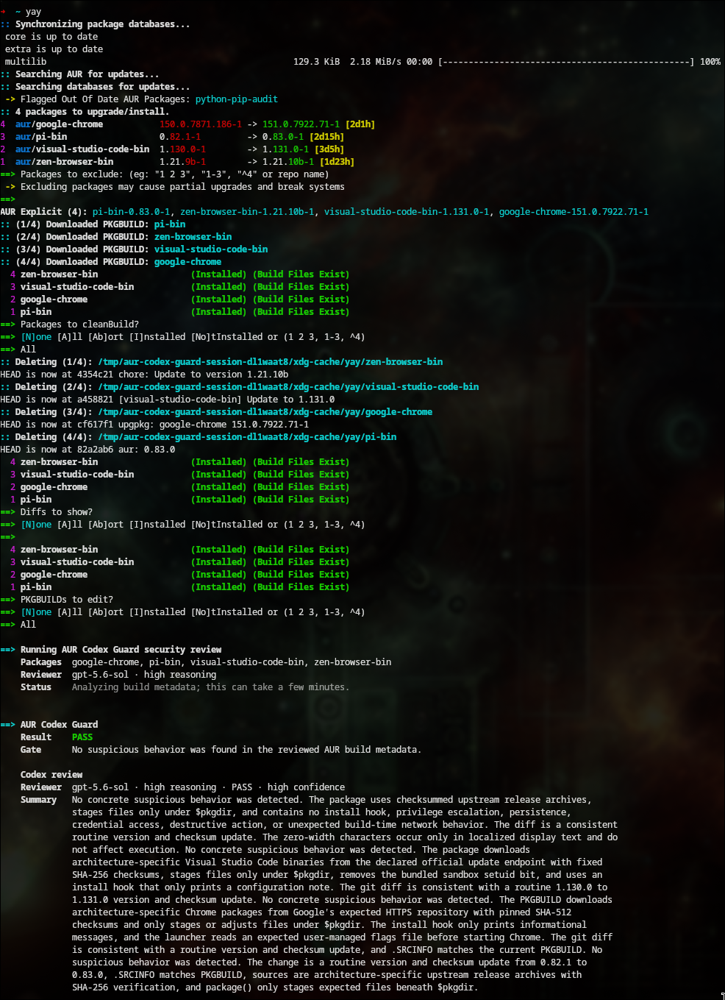

# AUR Codex Guard


[](https://github.com/mathisen99/aur-codex-guard/actions/workflows/ci.yml)
[](LICENSE)

A fail-closed security review for AUR packages installed with [`yay`](https://github.com/Jguer/yay). It checks downloaded build metadata with deterministic rules and Codex before `makepkg` runs, then verifies the reviewed files and built package archive before installation.

> [!WARNING]
> This is pre-release security tooling. It reduces risk; it cannot prove that a package or its upstream source is harmless.

## What happens when you run `yay`

1. Repository packages behave normally.
2. AUR metadata is downloaded into a fresh private session.
3. The guard scans every metadata file and asks `gpt-5.6-sol` with high reasoning to review it.
4. A clean, high-confidence review continues automatically. A genuine concern requires your explicit approval or blocks the transaction.
5. The reviewed files and final package archive are checked again before Pacman installs anything.

The user-facing results are simple:

| Result | Meaning |
| --- | --- |
| `PASS` | No suspicious behavior was found in the reviewed metadata. |
| `REVIEW` | Unusual behavior needs an explicit human decision. Pressing Enter keeps it blocked. |
| `BLOCK` | The package is not allowed to build or install. |

## Requirements

- Arch Linux with `yay` installed at `/usr/bin/yay`
- Python 3.11 or newer
- Codex CLI 0.145.0 or newer, authenticated and available as `codex`
- `yay` 13.x, `makepkg` 7.x, and `bsdtar` 3.x

The built-in doctor checks the exact compatibility contract.

## Install

From this checkout:

```bash
./aur-codex-guard doctor --live
sudo ./scripts/install-system.sh
rehash
command -v yay
```

The last command must print `/usr/local/bin/yay`. The installer adds root-owned files only beneath `/usr/local`; Arch's package-managed `/usr/bin/yay` remains unchanged.

## Use

Use `yay` normally:

```bash
yay
yay -S package-name
```

Only AUR packages trigger package review. Queries, searches, removals, and repository-only operations do not have AUR metadata to review.



The system shim deliberately refuses transaction shapes it cannot guard safely, including `yay package-name`, `yay -B`, `yay -U`, and download-only AUR syncs. Use `yay -S package-name` for installation. Calling `/usr/bin/yay` directly bypasses the guard.

To remove the installed shim and guard files:

```bash
sudo ./scripts/uninstall-system.sh
rehash
```

## Important limits

- The guard reviews AUR build metadata, not every line of downloaded upstream source or compiled binary.
- After approval, `makepkg` executes the package build as your user. This project is a gate, not a build sandbox.
- A compromised dependency, upstream release, compiler, build tool, or sufficiently disguised payload may still evade review.
- Failed builds can leave downloaded sources, build dependencies, or temporary artifacts, although Pacman installation remains blocked.

For the complete security boundary, failure behavior, bypasses, and residual risks, read the [threat model](docs/threat-model.md).

## Maintain and test

```bash
python3 -m unittest discover -s tests -v
python3 scripts/run_policy_evals.py
ruff check .
ruff format --check .
mypy aur_codex_guard
shellcheck scripts/*.sh packaging/system/*
```

GitHub Actions runs the unit tests on the minimum and current supported Python versions, builds the wheel, checks formatting and types, and runs the language-independent security-policy matrix. A weekly Arch container workflow checks current `yay`, `makepkg`, `bsdtar`, and Codex CLI compatibility without model credentials.

See [CONTRIBUTING.md](CONTRIBUTING.md) for the maintenance and release checklist. Security issues should follow [SECURITY.md](SECURITY.md).

## License

[MIT](LICENSE) © 2026 Tommy Mathisen
